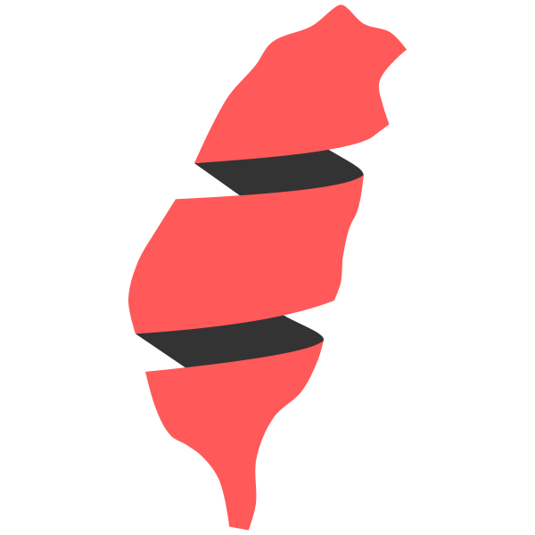

# Direct Style in Scala
## Conquering Concurrency with Elegance and Power

## 張瑋修 Walter Chang
### @weihsiu / weihsiu@gmail.com


https://github.com/weihsiu/fpffp

---

# Scala Taiwan
## [Scala Taiwan Discord server](https://discord.gg/nkQrkTwBgY)
## [Scala Taiwan FB group](https://www.facebook.com/groups/ScalaTW/)
## [Scala Taiwan Meetup](https://www.meetup.com/Scala-Taiwan-Meetup/)

---
# Agenda
- What is Direct Style?
- Why use Direct Style?
- Project Loom to the rescue
- Structured concurrency
- Gears
- Ox
- Capabilities
- Q&A

---
# What is Direct Style?
- Straight forward programming style
- Concurrency simplified
- Back to the basics

```scala
val a = getA()
val b = doSomethingWithA(a)
val c = doSomethingWithB(b)
val d = doSomethingWithC(c)
```

---
# Why use Direct Style?
- Concurrency is hard
- Direct Style has everything to do with concurrency
- Non-blocking (efficient use of threads)
- So everything is a callback
- But sequencing is the key
  * Callback hell
  * Monad (hell?)

---
# Callback hell
- Asynchronous
```scala
getA(a =>
  doSomethingWithA(a, b =>
    doSomethingWithB(b, c =>
      doSomethingWithC(c, d =>
        // ...  
      )
    )  
  )  
)
```

---
# Monad (hell>)
- Also asynchronous
```scala
for
  b <- doSomethingWithA(a)
  c <- doSomethingWithB(b)
  d <- doSomethingWithC(c)
yield d
```
- Both aren't intuiitive enough

---
# Project Loom to the rescue
- Java 21+
- Virtual threads
  * n native thread -> m virtual thread
  * m is much larger than n
- Still blocking but virtually
- For ScalaNative, delimited continuation is used
- For ScalaJS, source code rewriting is possible

---
# Structured concurrency
- Scope
  * In Gears: Async.blocking()
  * In Ox: supervised()
- Scope can have sub-scopes
- When scope exits, it cancels all the running child virtual threads
- All child virtual threads have to end before the parent scope exits

---
# Gears
- EPFL project
- Make Direct Style simpler than Java
- Support JVM and native
- Channel
  * Can send and receive messages
- ChannelMultiplexer
  * Multiple sender and receiver channels
- Examples
  * runSum()
  * runSleepSort()
  * runSyncChannel()
  * runSleepSort2()

---
# Ox
- Softwaremill project
- A thin wrapper around virtual threads
- Only support JVM
- Examples
  * HelloOx.scala
  * runOxSocketServer()
  * runOxSocketClient()

---
# Capabilities
- Scala 3 Context function
- Examples
  * ContextFunction.scala
  * runPrint() // Print.scala
  * runPrintSample() // Sample.scala
  * runGameOfLife()
    - Grid is a virtual thread
    - Every cells is also a virtual thread
    - Communication is done via channel multiplexer with events
    - Tick event tells every cell to send ReportCell event

---
# Q&A
## That's all and thank you for your attention

https://github.com/weihsiu/fpffp


